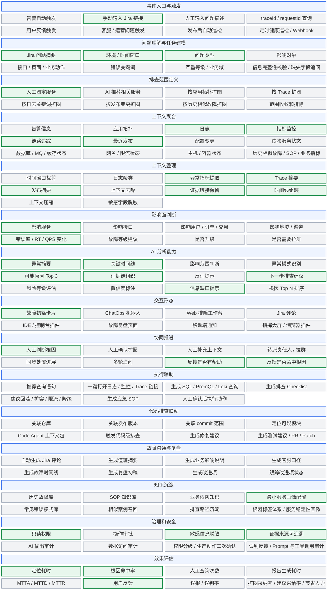

# AI 线上问题排查产品与 MVP 设计

## 1. 完备能力地图

课题可以定义得比较大，例如：

> AI 线上问题排查平台 / AI Incident Copilot。

完备产品不是一个简单的 ChatBot，而是一套围绕线上问题的排查辅助产品。它要覆盖从“问题进入”到“人工完成判断和修复”的完整协作闭环。

```text
问题入口
  ↓
问题理解与任务建模
  ↓
排查范围定义
  ↓
排查上下文准备
  ↓
AI 初筛分析
  ↓
结果交付与人工判断
  ↓
反馈、度量与沉淀
```

### 1.1 产品能力地图总览

| 产品能力域     | 完备产品能力                                                                                                          | 最小 MVP 范围                            |
|-----------|-----------------------------------------------------------------------------------------------------------------|--------------------------------------|
| 事件入口与触发   | 告警自动触发、Jira / 工单触发、人工输入问题描述、traceId / requestId 查询、用户反馈触发、客服 / 运营问题触发、发布后自动巡检触发、定时健康巡检、OpenAPI / Webhook 接入     | 仅支持手动输入 Jira 链接                      |
| 问题理解与任务建模 | 问题摘要、环境、时间窗口、问题类型、影响对象、接口 / 页面 / 业务动作、错误关键词、严重等级、业务域、责任团队、信息完整性校验、缺失字段追问                                        | 从 Jira 读取问题摘要；人工填写环境、时间窗口、问题类型       |
| 排查范围定义    | 人工圈定服务、AI 推荐相关服务、按应用拓扑扩圈、按 Trace 扩圈、按日志关键词扩圈、按发布变更扩圈、按历史相似故障扩圈、范围收敛和排除                                          | 人工圈定服务                               |
| 上下文聚合     | 告警信息、应用拓扑、日志、指标监控、链路追踪、最近发布、配置变更、依赖服务状态、数据库 / MQ / 缓存状态、网关 / 限流状态、主机 / 容器状态、历史相似故障、SOP、业务指标                     | 日志、指标监控、链路追踪、最近发布                    |
| 上下文整理     | 时间窗口裁剪、日志聚类、异常指标提取、Trace 摘要、发布摘要、上下文去噪、证据链接保留、时间线组装、上下文压缩、敏感字段脱敏                                                | 四类上下文摘要、证据链接、关键时间线                   |
| 影响面判断     | 影响服务、影响接口、影响用户、影响订单 / 交易、影响地域 / 渠道、错误率变化、RT 变化、QPS 变化、故障等级建议、是否升级、是否需要拉群                                        | 影响服务、错误率 / RT / QPS 变化               |
| AI 分析能力   | 异常摘要、时间线生成、影响范围判断、异常模式识别、根因假设生成、证据链组织、反证提示、下一步排查建议、风险等级评估、置信度标注、信息缺口提示、根因 Top N 排序                              | 异常摘要、关键时间线、可能原因 Top 3、证据链、下一步建议、信息缺口 |
| 交互形态      | 告警卡片、ChatOps 机器人、Web 排障工作台、Jira 评论、IDE / 控制台插件、故障复盘页面、移动端通知、指挥大屏、浏览器插件                                          | 故障初筛卡片                               |
| 协同推进      | 人工判断根因、人工确认扩圈、人工补充上下文、转派责任人、拉群、同步处置进展、多轮追问、标记结论是否有效、真实根因回填、协同记录沉淀                                               | 反馈是否有帮助、是否命中根因                       |
| 执行辅助      | 推荐查询语句、一键打开日志 / 监控 / Trace 链接、生成 SQL / PromQL / Loki 查询、生成排查 Checklist、建议回滚 / 扩容 / 限流 / 降级方案、生成应急 SOP、人工确认后执行动作 | 不纳入 MVP                              |
| 代码排查联动    | 关联仓库、关联发布版本、关联 commit 范围、定位可疑模块、生成 Code Agent 上下文包、触发代码级排查、生成修复建议、生成测试建议、生成 PR / Patch                          | 不纳入 MVP                              |
| 故障沟通与复盘   | 自动生成 Jira 评论、生成值班摘要、生成业务影响说明、生成客服口径、生成故障时间线、生成复盘初稿、生成改进项、跟踪改进项状态                                                | 不纳入 MVP                              |
| 知识沉淀      | 历史故障库、SOP 知识库、业务依赖知识、服务画像、常见错误模式库、相似案例召回、排查路径沉淀、根因标签体系、服务稳定性画像                                                  | 最小服务画像配置                             |
| 治理和安全     | 只读权限、操作审批、敏感信息脱敏、证据来源可追溯、AI 输出审计、数据访问审计、权限分级、生产动作二次确认、误判反馈机制、Prompt / 工具调用审计                                    | 只读权限、敏感信息脱敏、证据来源可追溯                  |
| 效果评估      | 定位耗时、根因命中率、人工查询次数、报告生成耗时、MTTA / MTTD / MTTR、用户采纳率、误报 / 误判率、扩圈采纳率、建议采纳率、节省人力估算                                   | 定位耗时、根因命中率、用户反馈                      |

### 1.2 产品能力地图 Mermaid 图

图中绿色为最小 MVP 范围，灰色为非 MVP 范围。这里保留完备产品能力，MVP 只是其中被高亮的一小部分。



## 2. MVP 最终结论

完整产品可以很大，但第一版 MVP 应该收敛为：

> Jira 驱动的 AI 故障初筛卡片生成器。

核心产品逻辑是：

> 用户手动输入 Jira 链接，并填写环境、时间窗口、问题类型和服务范围；系统准备圈定服务在该时间段内的日志、监控、Trace 和发布记录；AI 生成一张带证据的故障初筛卡片，供研发人工判断。

### 2.1 第一版边界

第一版只验证一个核心假设：

> AI 能否基于多源排障上下文，减少人工跨平台查资料和组织证据的时间。

第一版不验证：

- AI 自动发现相关服务
- AI 自动扩圈
- AI 自动告警触发
- AI 自动处置故障
- AI 进入代码仓库修复问题

### 2.2 MVP 输入

必填：

- Jira 链接
- 环境
- 时间窗口
- 问题类型
- 服务列表

可选：

- 接口名
- 错误关键词

### 2.3 MVP 处理流程

```text
手动输入 Jira 链接
        ↓
人工填写环境、时间窗口、问题类型
        ↓
人工圈定服务范围
        ↓
准备日志 / 监控 / Trace / 发布记录
        ↓
AI 生成故障初筛卡片
        ↓
人工判断并反馈是否有帮助、是否命中根因
```

### 2.4 MVP 输出

AI 输出一张结构化故障初筛卡片：

- 异常摘要
- 影响服务和关键指标变化
- 关键时间线
- 可能原因 Top 3
- 每个原因对应的证据
- 建议下一步排查动作
- 信息缺口

### 2.5 MVP 不做什么

- 不支持告警自动触发
- 不支持 ChatOps
- 不支持 Webhook
- 不自动识别服务
- 不自动推荐相关服务
- 不自动扩圈
- 不做多轮对话
- 不做 Code Agent 联动
- 不做回滚 / 扩容 / 降级建议
- 不执行任何生产操作
- 不接配置变更、中间件状态、历史故障
- 不生成复盘报告
- 不处理纯业务数据问题

### 2.6 最终定义

最终 MVP 可以定义为：

> 面向研发和值班同学的 Jira 驱动 AI 故障初筛卡片生成器。用户手动输入 Jira 链接并补充排查条件，系统基于人工圈定的服务范围准备日志、监控、Trace 和发布记录，由 AI 生成带证据的初筛卡片，最后由人工判断和反馈效果。

这个 MVP 足够小，但仍然保留了核心闭环：

- 有入口：手动 Jira
- 有范围：人工圈定服务
- 有上下文：日志、监控、Trace、发布记录
- 有 AI 输出：故障初筛卡片
- 有人工判断：确认是否命中
- 有效果评估：定位耗时、根因命中率、用户反馈
